<!-- Encoding: UTF-8 -->

# MeowDeck — Virtual Cat Companion (Web Demo)
---

## Turkish
# MeowDeck — Kedi Asistanı (Web Demo)

MeowDeck, kendi **kişisel kedini** oluşturup (isim + karakter/trait seçimi), küçük sahneler üzerinden onunla etkileşime girdiğin **pixel-art web tabanlı mini oyun/prototip**.

Şu an proje **demo aşamasında**: temel ekran akışı ve UI iskeleti hazır. Asıl hedef, kedinin ihtiyaçlarını (açlık / ilgi  / düşük enerji gibi) hissedip ona göre “besle–oyna–temizle” döngüsüyle yaşayan bir kedi sim deneyimi vermek.

---

## Demo Akışı (Mevcut)

- Splash / Loading
- Cat Select (demo: sadece beyaz kedi aktif!!)
- Traits (karakter seçimi)
- Name Modal (kediyi isimlendirme)
- Scene2 (unbox)
- Bathroom (mini etkileşim)
- Main Screen (butonlar + genel UI)
- Profile (kalp statları: happiness / cleanliness / hunger / energy)

> Not: Demo verileri LocalStorage’da tutulur.  
> Reset: `Shift + R`

---

## Ekran Görüntüleri

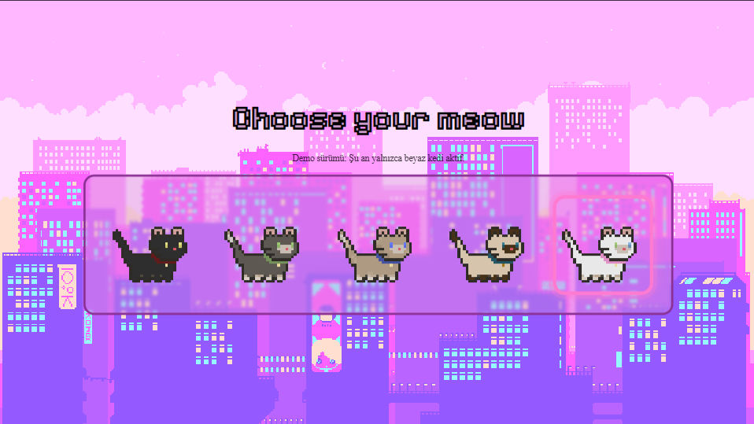
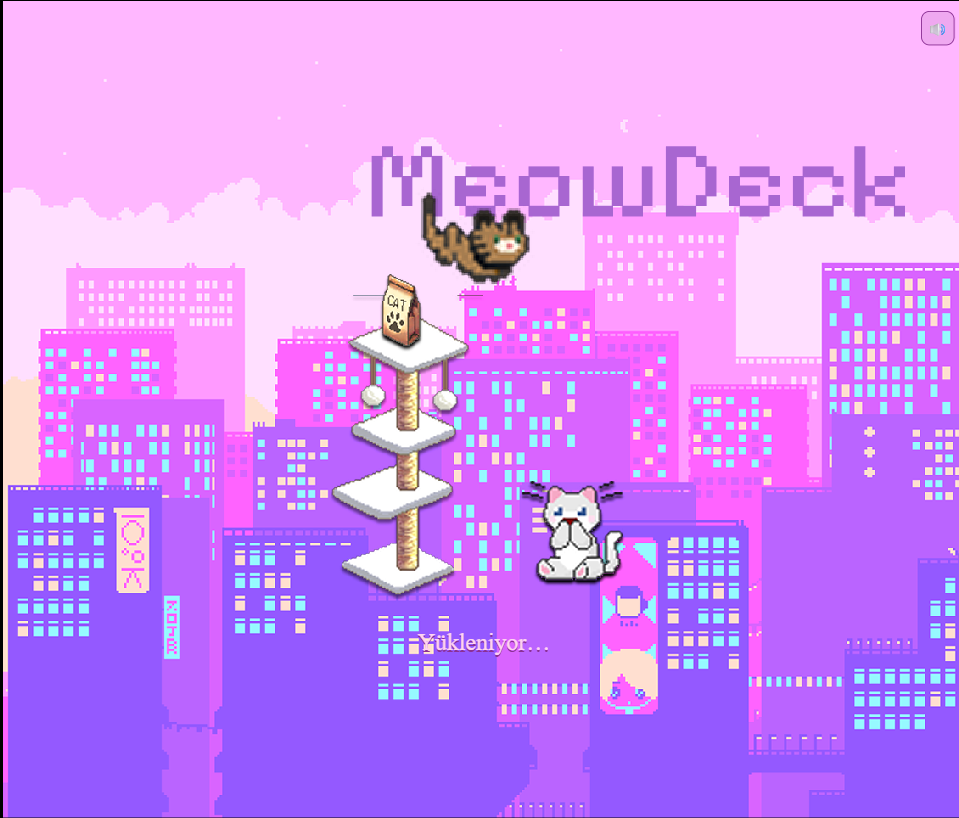
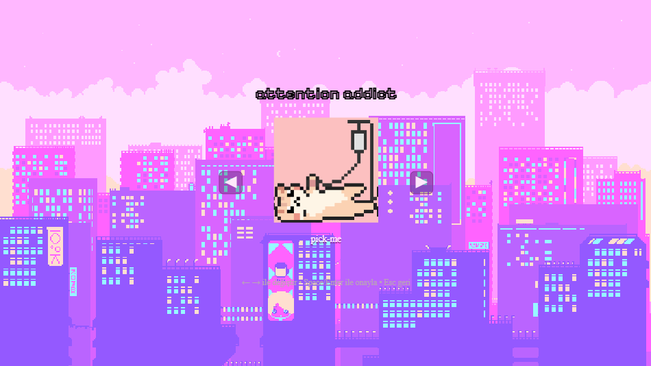
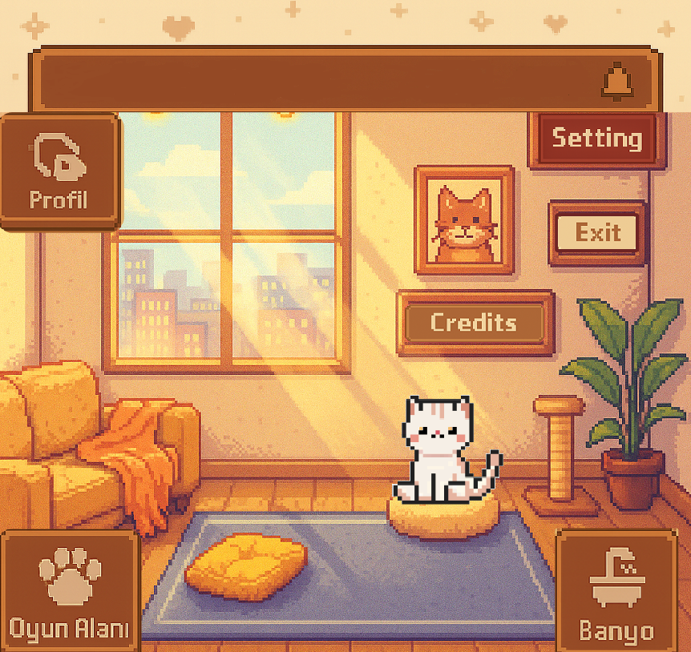
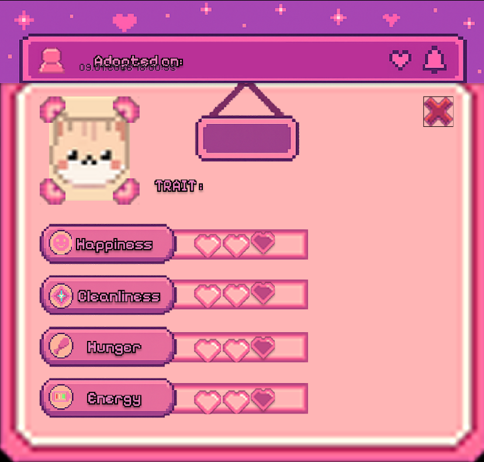
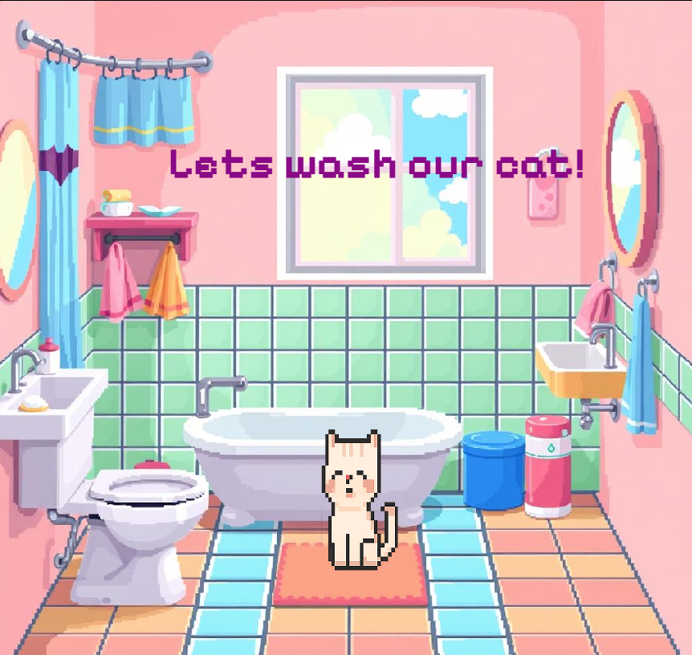
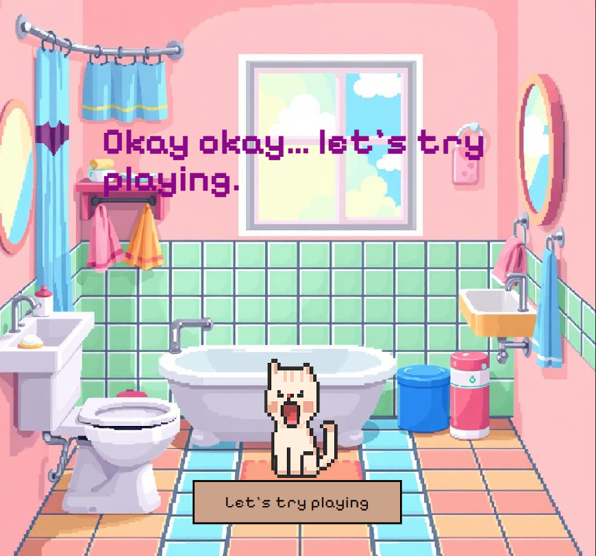
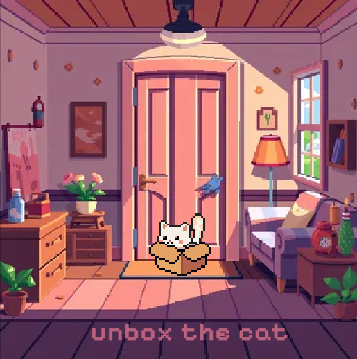
---

## Kurulum / Çalıştırma (Web)

Bu proje şu an **desktop web demo** gibi çalışacak şekilde tasarlandı.

1. Repo’yu indir / clone’la
2. `index.html` dosyasını tarayıcıda aç

> Tavsiye: Live Server (VS Code) ile açarsan daha rahat olur.

---

## Proje Yapısı (Özet)

- `index.html` → ekranlar (sections) + UI iskeleti
- `style.css` → pixel UI yerleşimleri + responsive scale mantığı
- `script.js` → ekran akışı, input, LocalStorage state, audio/sfx altyapısı
- `assets/` → tüm görseller (UI, cat sprites, scene bg, audio vs.)
- `docs/` → GitHub’da göstermek için ekran görüntüleri / mockup’lar

---

## Bilinen Eksikler / Demo Limitleri

- Oyun mekaniği henüz tam değil (statlar otomatik düşmüyor, ihtiyaç sistemi yok)
- UI polish gerekiyor (bazı ekranlarda hizalama/ölçek optimizasyonu)
- Bazı butonlar placeholder (Settings / Credits / Exit / Playroom gibi)
- Ses dosyaları ve ses tasarımı eksik (miyav / bağırma / ambience çeşitliliği)
- Sahne geçişleri “cut” gibi — animasyon/transitions yok

---

## Roadmap (İleride Eklenecekler)

### Gameplay / Sim Mantığı
- Stat sistemini gerçek “kedi sim” döngüsüne çevirmek  
  (zamanla acıkma, kirlenme, enerji düşmesi, mutluluk azalması)
- Besleme / oyun / temizlik etkileşimlerini statlara bağlamak

### Animasyon & Sahne Geçişleri
- Ekran geçişlerinde fade/slide gibi **transition animasyonları**
- Buton hover/click animasyonları (pixel bounce gibi)
- Duş animasyonu 
- Mini game ekleme: **fare kovalama**, oyuncak yakalama vb.

### Ses & Haptic Hissi
- Miyav / mırıldanma / bağırma gibi sfx çeşitleri
- Sahne bazlı ambience (banyo, playroom vb.)
- Buton click/hover sesleri

### Ek Sahne/Fonksiyonlar
- Veteriner “hatırlatma” sistemi (takvim gibi)  
  > Büyük sahne yapmak yerine bildirim/hatırlatma mantığı daha mantıklı olabilir.

## İleride Eklenecekler için MockUp-Gui

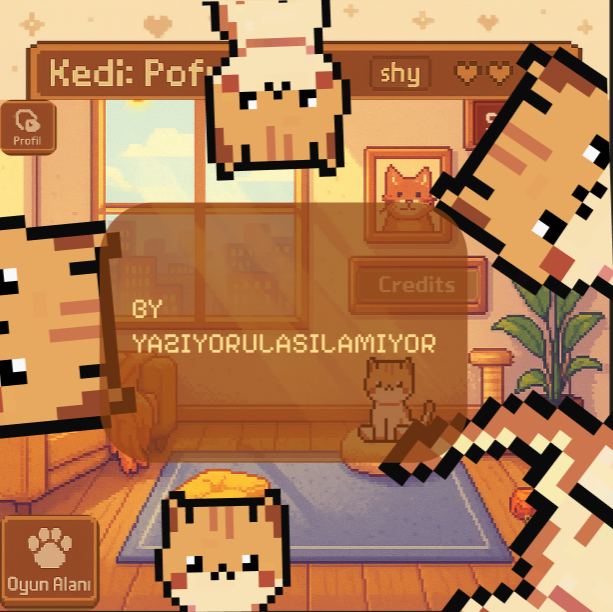
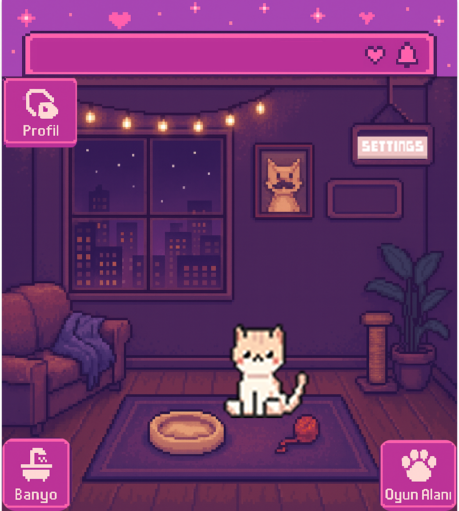
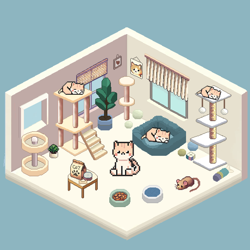
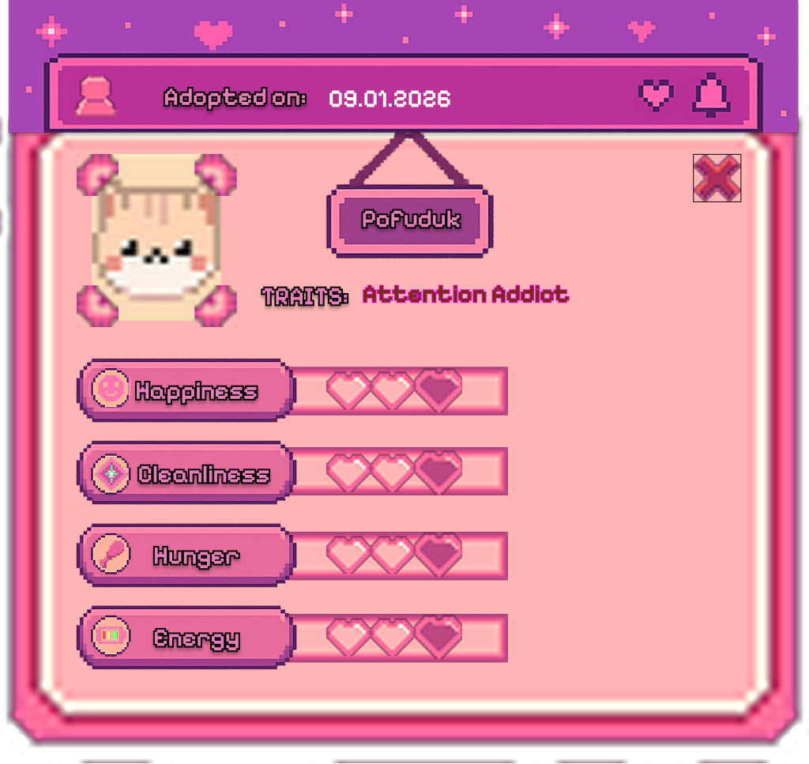
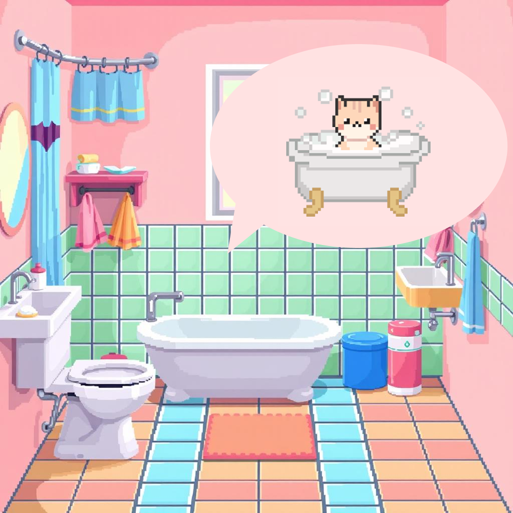

---

## Notlar
Bu repo bir **prototip / demo** olarak konumlandı.  
Odak: UI flow, sahne yapısı, asset pipeline ve “kedi sim” temel hissi.

---

## Lisans
TBD (gerekirse MIT eklenebilir)

----

## 🇬🇧 English

### 🎯 Purpose
MeowDeck is a small virtual pet demo where the user adopts and takes care
of a personal cat.

The cat has basic needs such as hunger, happiness, energy, and cleanliness.
Over time, the cat may get bored, tired, or demand attention.
The user can interact with the cat by playing, bathing, or engaging in
simple activities to improve its status.

### 🚧 Project Status
This project is currently in **demo stage**.
Many core mechanics are still under development.

### 🧩 Missing & Planned Features
- UI improvements (button hover / click animations)
- Animated scene transitions
- Sound effects (meowing, screaming, etc.)
- Bathing animation
- Mini games (mouse chasing, etc.)
- Vet reminder system (notification-based)
- More dynamic stat management system

---

## ⚖️ License
License: TBD  
(May be released under MIT license in the future.)